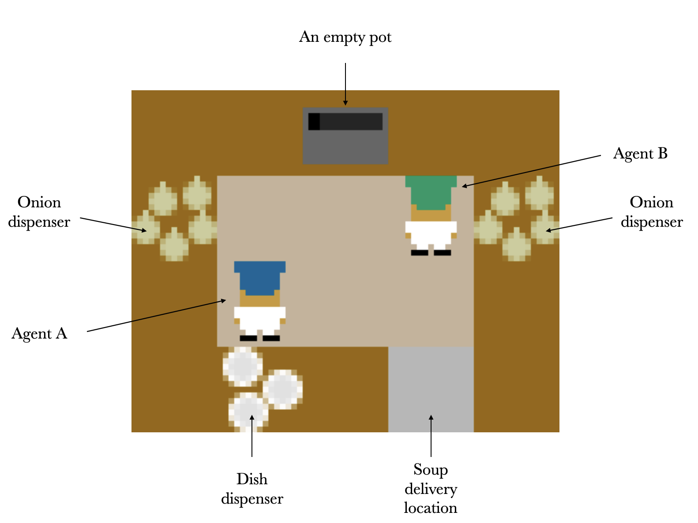
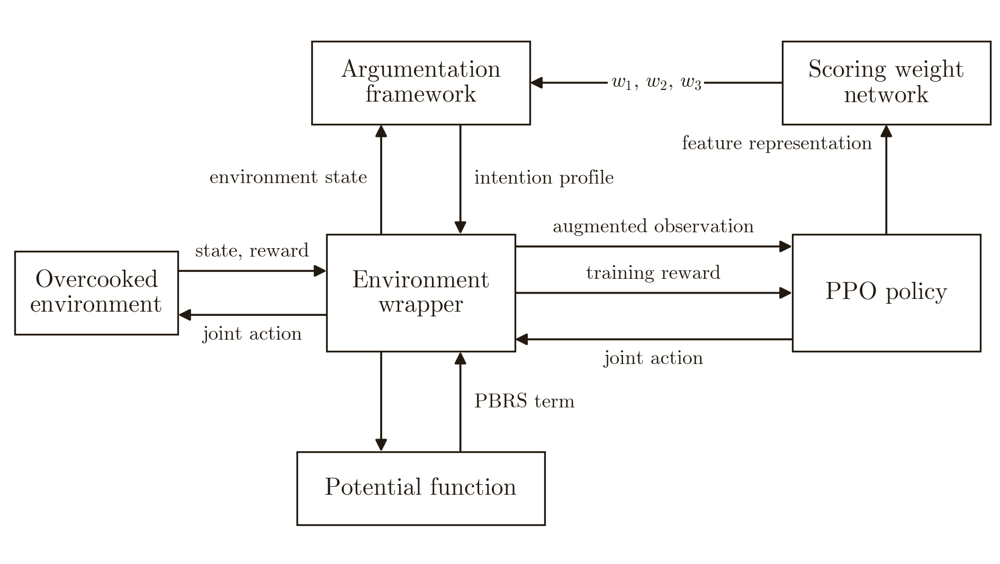
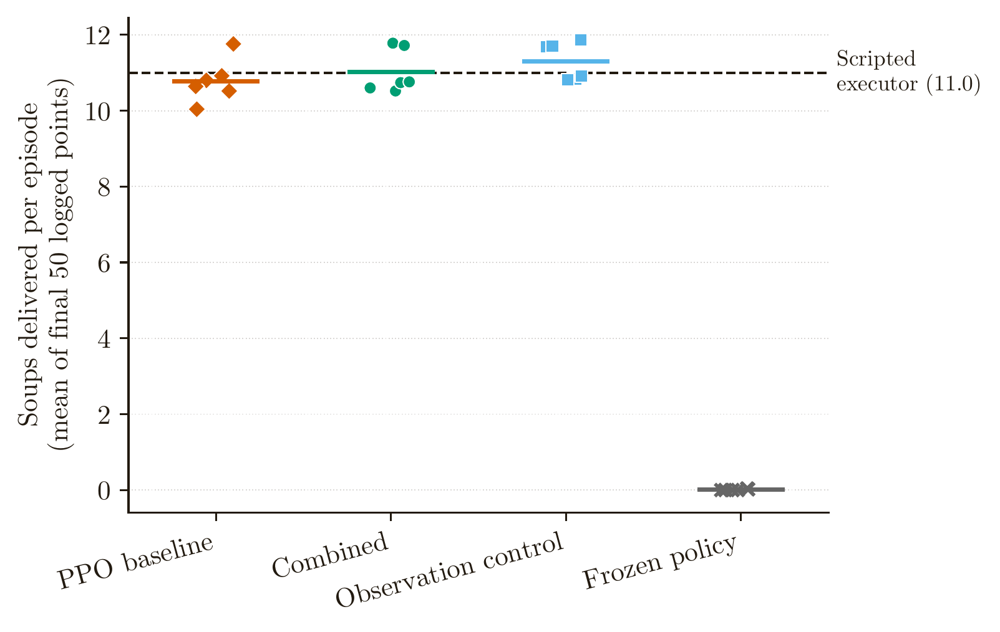

# Argumentation-Based Coordination for Multi-Agent Reinforcement Learning in Overcooked

## Abstract

In cooperative multi-agent reinforcement learning, coordination can be learned from task reward alone. However, policies do not explicitly represent what each agent intends and give designers no direct route to supply coordination knowledge in advance. To test whether an argumentation-derived intention signal assigning high-level subtasks to the agents improves coordination, this thesis implemented Argumentation-Guided Reinforcement Learning (ArgRL), an integrated system in which a value-based argumentation framework produces an intention profile for agents trained with proximal policy optimisation (PPO). The framework used a state-adaptive attack relation, meaning that candidate intentions attacked one another only when they were mutually incompatible in the current state. The agents were trained in Overcooked-AI, a cooperative soup delivery task. The profile was appended to their observations and used to construct a potential-based shaping term added to the training reward. Four conditions compared ArgRL-Full with the PPO baseline, ArgRL-Obs and ArgRL-Frozen, with six seeds each in the Cramped Room layout. Four tests were fixed beforehand.

With both channels active, performance was 0.240 soups delivered per episode higher than the PPO baseline. Although the Holm-corrected p-value was 0.748 and the 95% bootstrap interval [-0.347, 0.827] contained zero, the observation comparison had the larger effect size of the two channel comparisons. Learning efficiency was assessed exploratorily using normalised area under the training curve and the steps needed to reach 80% of final performance, both specified after the curves had been inspected. The two conditions receiving the intention profile learned faster on both measures, on all six seeds, while the shaping term alone did not. The frozen-policy comparison was the only one of the four tests to reach statistical significance, showing that PPO agents required policy learning to carry out the supplied subtasks. A scripted executor then showed that learning was not required when a controller could execute those intentions directly. Intentions selected by the framework and a fixed role split both produced 11.000 soups delivered per episode, showing that the framework matched a strong fixed coordination strategy, although there was no observable advantage from state-adaptive selection for this executor in Cramped Room. Overall, the framework made high-level coordination inspectable, produced executable intentions and was consistently associated with faster learning on the exploratory convergence measures, although it did not produce a detectable improvement in final measured performance in the setting tested.



The Cramped Room layout. Two agents share one pot, two onion dispensers, a dish dispenser and one delivery point. Three onions make a soup, and a delivered soup scores 20.

## How it works



The system architecture. The framework runs inside the environment wrapper and returns one intention per agent. That profile reaches the learner through two channels. The observation channel appends the profile to each agent's observation. The shaping channel turns it into a potential-based shaping term added to the training reward. The conditions below switch these channels on and off independently.

## Repository structure

```text
af/                         the core argumentation method
  __init__.py               package marker
  framework.py              builds and resolves the value-based argumentation framework
  scoring.py                calculates argument scores
  reward_shaping.py         calculates the shaping reward
  policy.py                 PPO policy carrying the scoring weight network
  env_wrapper.py            Overcooked environments used for training
  bandit.py                 exploratory outcome-based weight updates
  scripted_executor.py      scripted executor for the intention source comparison

analysis/
  train.py                  trains each experimental condition
  confirmatory_analysis.py  reproduces the main results
  determinism_probe.py      checks that rewards are reproducible
  text_tables.py            formats the plain text tables the analyses print

exploratory/                exploratory experiments and analysis
  README.md                 what each exploratory analysis reports
  exploratory_analysis.py   component ablations, selection strategies, second
                            layout, shaping strength comparison and convergence
  bandit_analysis.py        the exploratory intention bias experiment against
                            ArgRL-Full and the PPO baseline
  shaping_only_analysis.py  the ArgRL-Shape condition

results/                    saved results used in the thesis

figures/                    figures used in this README

reproduce.ipynb             walkthrough of the environment, method and results
requirements.txt            project dependencies
AUTHOR_DECLARATION.txt      certifies authorship of the submitted source code
```


## Conditions

The code uses one identifier per condition, where each maps to the name used in the thesis.

| Identifier            | Thesis name         | Description                                                                    |
| --------------------- | ------------------- | ------------------------------------------------------------------------------ |
| `ppo_baseline`        | PPO baseline        | PPO on Overcooked's standard observation and training reward, including the built-in rewards for intermediate task actions, with no framework. |
| `argrl_frozen`       | ArgRL-Frozen       | The framework with fixed weights and no policy learning.                       |
| `argrl_full`            | ArgRL-Full            | The framework supplies the intention profile through the observation and shaping channels. |
| `argrl_obs` | ArgRL-Obs | The framework supplies the intention profile through the observation channel, with reward shaping disabled. |
| `argrl_shape`        | ArgRL-Shape        | The framework uses reward shaping, with the intention profile hidden from the policy observation. |
| `bandit`              | Intention bias (exploratory) | Both channels remain active, with fixed base scoring weights and outcome-driven per-intention biases. |

## Setup

Python 3.10 is required because the Overcooked library does not support Python 3.11.

From the project folder, install the dependencies:

```bash
python -m pip install git+https://github.com/HumanCompatibleAI/overcooked_ai.git
python -m pip install -r requirements.txt
```

## Reproducing the results

The saved results in `results/` can be used to reproduce the main analysis without retraining.



Each point represents one seed, with six seeds per condition. ArgRL-Full, ArgRL-Obs and PPO baseline perform similarly and lie close to the scripted executor benchmark. ArgRL-Frozen is the only condition that clearly separates itself.


```bash
python analysis/confirmatory_analysis.py
python analysis/determinism_probe.py
```

`confirmatory_analysis.py` and `determinism_probe.py` print their results to standard output. The reproduction notebook captures the same outputs.

`reproduce.ipynb` walks through the same steps with commentary, starting from a rendered view of the layout and one worked run of the framework.

Retraining all 24 confirmatory runs takes several hours.

### What the reported number measures

Performance is the mean soups delivered per episode over the final 50 logged episode outcomes.

Training does not log one value per episode. Every episode that finishes records `train/soups_delivered`, but Stable-Baselines3 writes only the last recorded value at the end of each rollout. With 2048 steps per rollout across four environments that is one surviving episode outcome every 8192 steps, so each 1M-step run contributes 123 logged points drawn from roughly 2400 episodes. The final 50 of those outcomes are sampled from the last 410k training steps.

## Training

All reported runs used four parallel environments. Use `analysis/train.py` with the required condition:

```bash
python analysis/train.py --condition ppo_baseline --n-envs 4
python analysis/train.py --condition argrl_frozen --n-envs 4
python analysis/train.py --condition argrl_full --n-envs 4
python analysis/train.py --condition argrl_obs --n-envs 4
```

Exploratory conditions:

```bash
python analysis/train.py --condition argrl_shape --n-envs 4
python analysis/train.py --condition bandit --n-envs 4
```

Ablations and alternative selection strategies can be applied to the ArgRL-Full condition:

```bash
python analysis/train.py --condition argrl_full --n-envs 4 --ablate coalition
python analysis/train.py --condition argrl_full --n-envs 4 --ablate load_ready
python analysis/train.py --condition argrl_full --n-envs 4 --ablate individual
python analysis/train.py --condition argrl_full --n-envs 4 --strategy conservative
```

The shaping term can be scaled, which is how the shaping strength comparison was run:

```bash
for seed in 0 1 2 3 4 5; do
  python analysis/train.py --condition argrl_full --n-envs 4 --scale 5 --seed $seed
  python analysis/train.py --condition argrl_full --n-envs 4 --scale 25 --seed $seed
done
```

The number of environments matters. It sets the rollout size and therefore both the gradient updates and the logging interval, so a run with a different `--n-envs` is not comparable with the cached ones.

The default run uses seed 42, one million training steps and a discount factor of 0.99. These can be changed:

```bash
python analysis/train.py --condition argrl_full --n-envs 4 --seed 1 --total-timesteps 1000000
```

`--gamma` sets the discount factor for PPO and for the potential shaping term together, since policy invariance holds only when the two match.

Training logs are saved in `logs/` and checkpoints in `checkpoints/`.  
To view the logs:

```bash
tensorboard --logdir logs/
```

The main performance measure is soups delivered per episode, recorded as `train/soups_delivered`.

The analysis scripts read from `results/`. To analyse new runs, copy the relevant run directories from `logs/` into `results/`.

## Exploratory material

The `exploratory/` folder contains the additional experiments and analyses reported as exploratory results. This includes the scripted executor, ArgRL-Shape condition, component ablations, second layout, shaping strength comparison, learned intention bias and convergence analysis.

See `exploratory/README.md`.

## References

Cited in the source code.

Bench-Capon, T. J. M. “Persuasion in Practical Argument Using Value-based Argumentation Frameworks.” *Journal of Logic and Computation*, 13(3), 429-448, 2003. Value-based argumentation, in `af/framework.py`.

Ng, A. Y., Harada, D. and Russell, S. J. “Policy Invariance Under Reward Transformations: Theory and Application to Reward Shaping.” ICML, 1999. Potential-based reward shaping, in `af/reward_shaping.py`.

Devlin, S. and Kudenko, D. “Dynamic Potential-Based Reward Shaping.” AAMAS, 2012. Dynamic reward shaping, in `af/reward_shaping.py`.

The work this project builds on.

Carroll, M. et al. “On the Utility of Learning about Humans for Human-AI Coordination.” NeurIPS, 2019. Overcooked-AI.

Dung, P. M. “On the Acceptability of Arguments and its Fundamental Role in Nonmonotonic Reasoning, Logic Programming and n-Person Games.” *Artificial Intelligence*, 77(2), 321-357, 1995. Abstract argumentation.

Schulman, J. et al. “Proximal Policy Optimization Algorithms.” arXiv:1707.06347, 2017. PPO.
